# ERD

### Find 3 exercises in the bottom of the document.

### Note existance of different types of notations

---

# Cardinality types notations

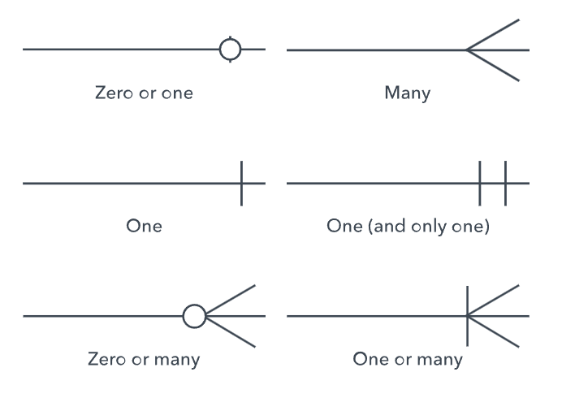

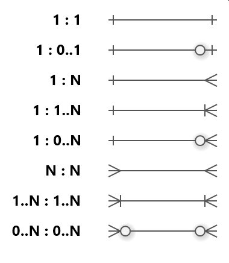

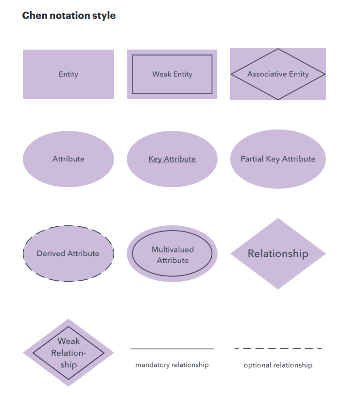

These symbols are Chen’s Entity-Relationship Diagram (ERD) notation used for database design:

    -   Entity (Rectangle): An independent real-world object or concept.

        -   Example: Student, Employee, Course.

    -   Weak Entity (Double Rectangle): An entity that cannot be uniquely identified by its own attributes alone and depends on a strong entity.

        -   Example: Dependent (linked to Employee), Room (linked to Building).

    -   Associative Entity (Diamond inside Rectangle): An entity that links two other entities in a many-to-many relationship and contains its own attributes.

        -   Example: Enrollment (links Student and Course, holding Grade).

    -   Attribute (Oval): A property or characteristic describing an entity.

        -   Example: First Name, Age, Email.

    -   Key Attribute (Underlined Text in Oval): An attribute that uniquely identifies an entity instance (Primary Key).

        -   Example: <u>StudentID</u>, <u>SSN</u>.

    -   Partial Key Attribute (Dashed Underlined Text in Oval): An attribute that uniquely identifies a weak entity only when combined with the key of its parent entity.

        -   Example: <u>DependentName</u> (unique only within a specific employee's family).

    -   Derived Attribute (Dashed Oval): An attribute whose value is calculated from another attribute rather than stored directly.

        -   Example: Age (derived from DateOfBirth).

    -   Multivalued Attribute (Double Oval): An attribute that can hold multiple values for a single entity.

        -   Example: PhoneNumbers, Skills.

    -   Relationship (Diamond): An association or connection between entities.

        -   Example: Teaches (between Professor and Course).

    -   Weak Relationship (Double Diamond): Connects a weak entity to its identifying parent entity.

        -   Example: Has (connects Employee to Dependent).

    -   Mandatory Relationship (Solid Line): Indicates that participation in the relationship is strictly required.

        -   Example: An Order must belong to a Customer.

    -   Optional Relationship (Dashed Line): Indicates that participation in the relationship is optional.

        -   Example: An Employee may be assigned to a Project.

---

# Notation with Cardinality

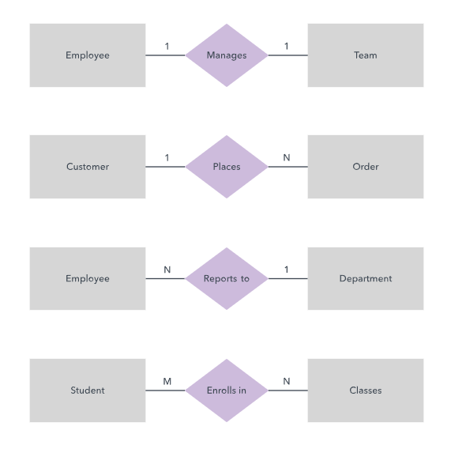

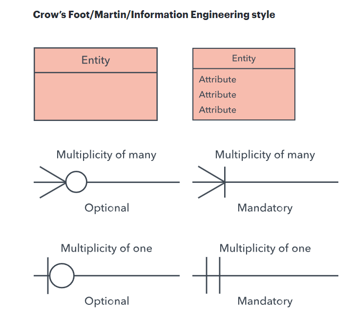

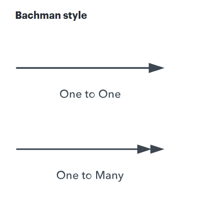

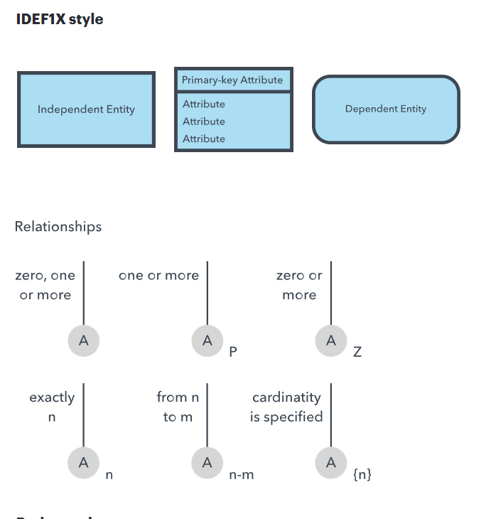

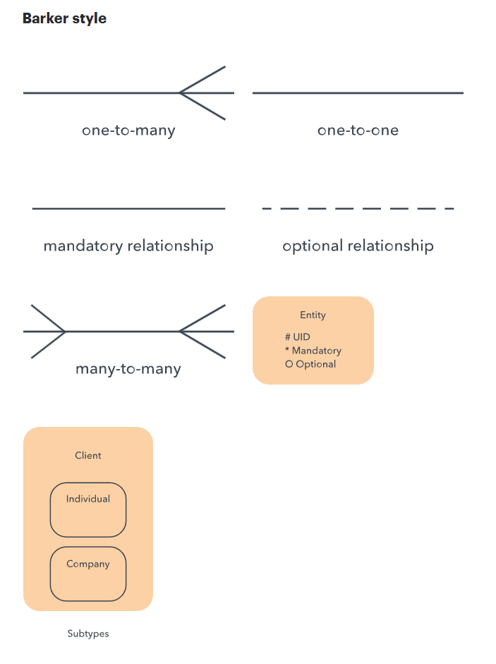

---

# SUM UP

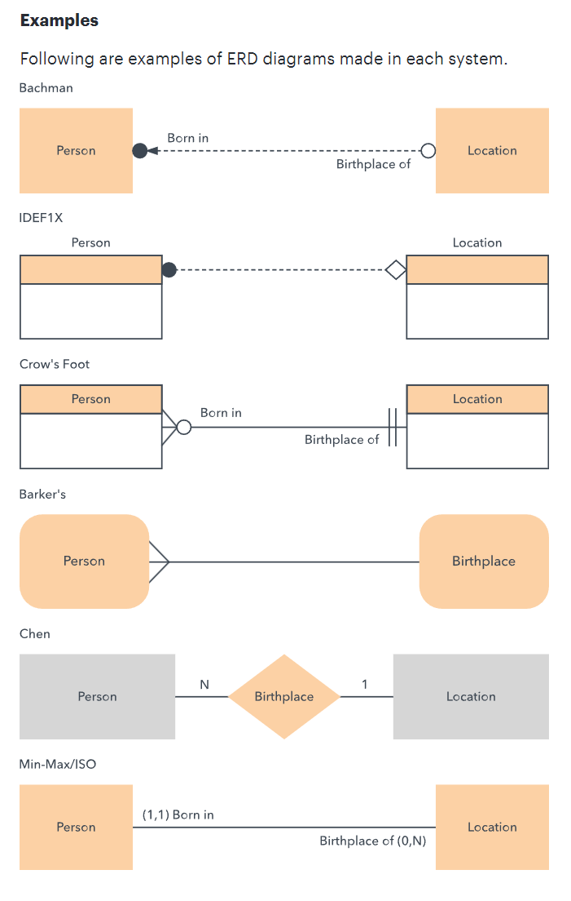

---
EXERCISE 1
---
University

- In a university, a Student enrolls in Courses.
- A student must be assigned to at least one or more Courses.
- Each course is taught by a single Professor.
- To maintain instruction quality, a Professor can deliver only one course

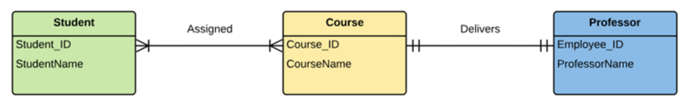

source [link](https://www.guru99.com/er-diagram-tutorial-dbms.html#how-to-create-an-entity-relationship-diagram-erd)

---
EXERCISE 2
---

Look through an example of a complicated ERD on University management system [LINK](https://vertabelo.com/blog/er-diagram-for-a-university-database/)

---
EXERCISE 3
---
Manufacturer

A manufacturing company produces products. The following product information is stored: product name, product ID and quantity on hand. These products are made up of many components. Each component can be supplied by one or more suppliers. The following component information is kept: component ID, name, description, suppliers who supply them, and products in which they are used. Use Figure B.1 for this exercise.

Create an ERD to show how you would track this information.

Show entity names, primary keys, attributes for each entity, relationships between the entities and cardinality.

Assumptions
- A supplier can exist without providing components.
- A component does not have to be associated with a supplier.
- A component does not have to be associated with a product. Not all components are used in products.
- A product cannot exist without components.

ERD Answer
- Component(CompID, CompName, Description) PK=CompID
- Product(ProdID, ProdName, QtyOnHand) PK=ProdID
- Supplier(SuppID, SuppName) PK = SuppID
- CompSupp(CompID, SuppID) PK = CompID, SuppID
- Build(CompID, ProdID, QtyOfComp) PK= CompID, ProdID

Diagram
---
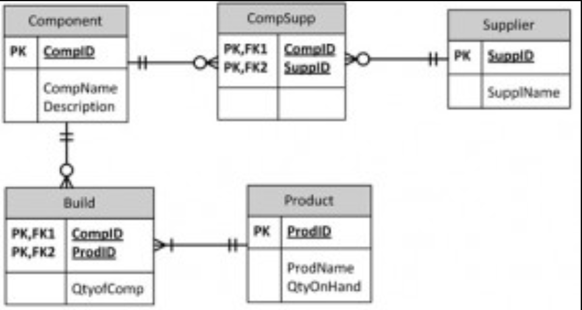

source [link](https://opentextbc.ca/dbdesign01/back-matter/appendix-b-erd-exercises/)

